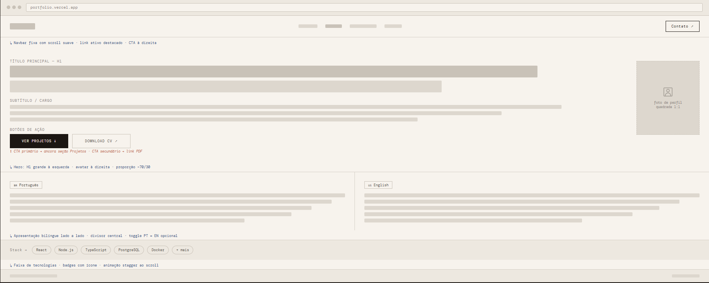
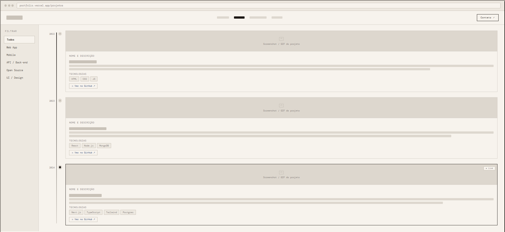
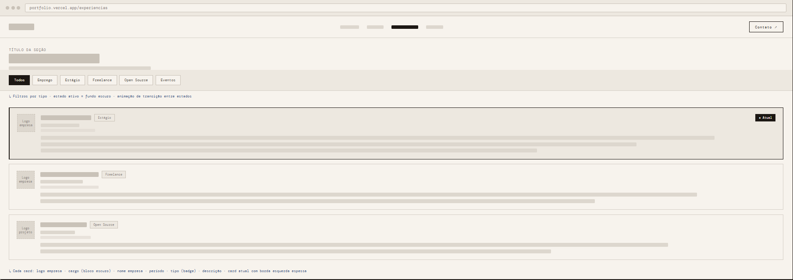
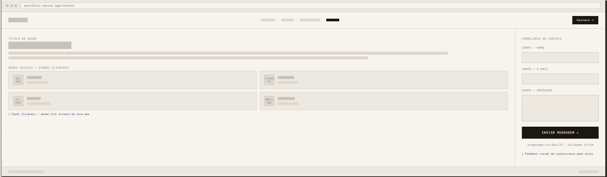

# Portfólio Profissional

Portfólio desenvolvido na disciplina Laboratório de Desenvolvimento de Software da PUC Minas. O site reúne a trajetória acadêmica e profissional, projetos desenvolvidos, experiências relevantes e formas de contato, centralizando as principais informações do perfil em um único lugar.

---

## Status do Projeto


---

## Índice

- [Links Úteis](#links-úteis)
- [Sobre o Projeto](#sobre-o-projeto)
- [Wireframes](#wireframes)
- [Funcionalidades](#funcionalidades-principais)
- [Tecnologias](#tecnologias-utilizadas)
- [Estrutura de Pastas](#estrutura-de-pastas)
- [Instalação e Execução](#instalação-e-execução)
- [Deploy](#deploy)
- [Autor](#autor)
- [Licença](#licença)

---

## Links Úteis

- **Demo Online:** [Em breve — Vercel](#)

---

## Sobre o Projeto

Este projeto foi desenvolvido na disciplina de Laboratório de Desenvolvimento de Software com o objetivo de reunir, em um único site, as principais informações do perfil acadêmico e profissional.

A proposta é facilitar a apresentação da trajetória, dos projetos e das experiências para professores, recrutadores e demais interessados. O site está organizado em quatro seções: apresentação pessoal bilíngue, linha do tempo de projetos com links para os repositórios, resumo de experiências e página de contato.

---

## Wireframes

Desenvolvidos em média fidelidade no Figma, cobrindo as quatro páginas do sistema.

| Página | Descrição |
|--------|-----------|
| **Sobre Mim** | Hero + apresentação bilíngue PT/EN + skills |
| **Projetos** | Timeline vertical com cards e links GitHub |
| **Experiências** | Cards com filtro por tipo de experiência |
| **Contato** | Links para redes sociais + formulário de mensagem |

| Sobre Mim | Projetos |
|:---------:|:--------:|
|  |  |

| Experiências | Contato |
|:------------:|:-------:|
|  |  |

---

## Funcionalidades Principais

- **Navegação:** menu fixo com Vue Router e transições suaves entre páginas
- **Sobre Mim:** apresentação bilíngue (PT/EN) e badges de tecnologias
- **Projetos:** timeline vertical com links para repositórios no GitHub
- **Experiências:** cards com filtro por tipo (estágio, freelance, open source, etc.)
- **Contato:** ícones para redes sociais e formulário integrado ao EmailJS *(Sprint 2)*

---

## Tecnologias Utilizadas

| Tecnologia | Versão | Uso |
|-----------|--------|-----|
| **Vue.js** | 3.4+ | Framework principal |
| **Vue Router** | 4.3+ | Roteamento entre páginas |
| **Vite** | 5.0+ | Build tool e dev server |
| **CSS3** | — | Estilização com variáveis CSS |
| **Google Fonts** | — | Syne + JetBrains Mono |
| **Vercel** | — | Hospedagem |
| **EmailJS** | — | Envio do formulário de contato *(Sprint 2)* |

---

## Estrutura de Pastas

```
portfolio/                          ← raiz do repositório
├── .gitignore
├── README.md
├── docs/
│   ├── wireframes/                 ← imagens dos wireframes (Figma)
│   └── LABORATÓRIO 01 - Alternativo - Portfólio Profissional.pdf
└── sprint1/                        ← projeto Vue.js (Sprint 01)
    ├── .gitignore
    ├── index.html
    ├── package.json
    ├── package-lock.json
    ├── vite.config.js
    ├── vercel.json
    └── src/
        ├── App.vue
        ├── main.js
        ├── assets/
        │   └── styles/
        │       ├── variables.css
        │       └── global.css
        ├── components/
        │   ├── Navegacao.vue
        │   └── Rodape.vue
        ├── router/
        │   └── index.js
        └── views/
            ├── Inicio.vue
            ├── Projetos.vue
            ├── Experiencias.vue
            └── Contato.vue
```

---

## Instalação e Execução

**Pré-requisitos:** Node.js v18+ e npm v9+

```bash
# Clone o repositório
git clone https://github.com/theuzao/portfolio-profissional.git
cd portfolio-profissional/sprint1

# Instale as dependências
npm install

# Inicie o servidor de desenvolvimento
npm run dev
```

```bash
npm run build    # build de produção
npm run preview  # prévia do build localmente
```

---

## Deploy

O projeto é hospedado na **Vercel**. Para replicar:

1. Faça push do repositório para o GitHub
2. Importe o repositório em [vercel.com](https://vercel.com)
3. Configure a pasta raiz como `sprint1/`, build command `npm run build` e output `dist`
4. Clique em **Deploy**

O arquivo `vercel.json` já está configurado para suportar o roteamento SPA do Vue Router.

---

## Autor

| Nome | GitHub |
|------|--------|
| Matheus Guilherme Viana Pereira | [github.com/theuzao](https://github.com/theuzao) |

---

## Licença

Este projeto é distribuído sob a [Licença MIT](./LICENSE).
